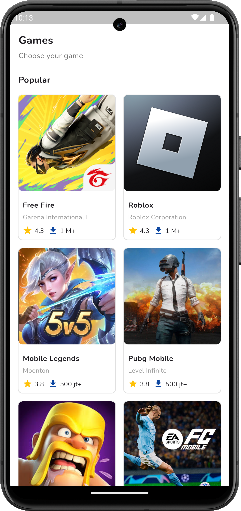
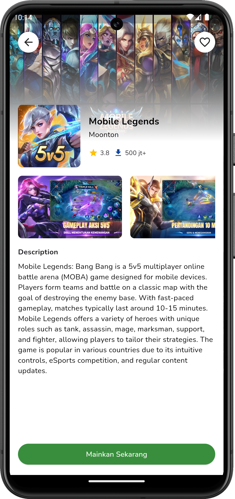

# Dicoding Submission : Belajar Membuat Aplikasi Flutter untuk Pemula

Rating Review : ★★★★★ (5 Stars)

## Submission Criteria

- There is a use of Stateless Widgets.
- There is use of Stateful Widgets.
- Have at least 2 (two) pages and implement Navigation.
- Does not have an overflow display (can adjust the screen size).
- Application themes that are submitted are free, but the more detailed and complete your application is, the higher the submission value.

## Preview

 
 
